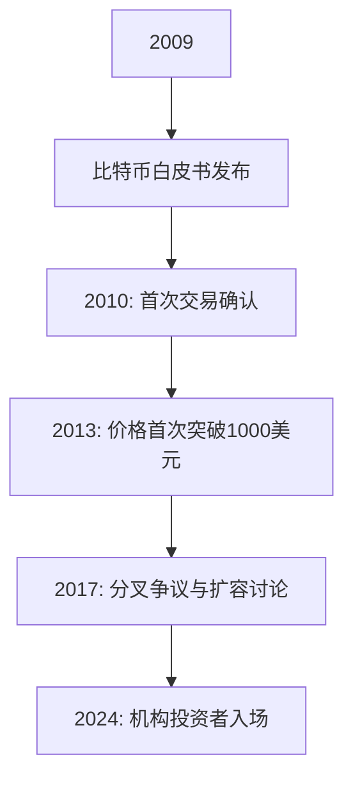

# 前比特币核心开发者否认中本聪身份争议

## 事件背景与核心争议

知名比特币早期开发者 Peter Todd 近日通过公开声明，正式否认自己与比特币创始人中本聪存在关联。这一表态发生在 HBO 纪录片《寻找中本聪》正式播出前数小时，引发区块链行业广泛关注。Todd 在个人社交平台明确指出，该纪录片制作团队 Cullen Hoback 的相关猜测属于"捕风捉影"，并强调自己从未参与过比特币白皮书的创作过程。

👉 [深入解析区块链技术发展](https://bit.ly/okx_welcome)

## 技术社区的长期质疑

自比特币诞生以来，加密货币社区持续进行着旷日持久的"中本聪身份之谜"探索。虽然 Todd 作为早期核心开发者在协议优化、交易验证等领域作出过重要贡献，但其始终未进入主流怀疑名单。值得注意的是，包括以下知名技术专家在内的多位行业先驱都曾被推测为潜在候选人：

| 被猜测人物       | 技术贡献领域       | 否认方式                  |
|------------------|--------------------|---------------------------|
| Hal Finney       | 首个比特币节点运行者 | 公开技术文档佐证          |
| Nick Szabo       | 智能合约概念提出者   | 学术论文时间线比对        |
| Craig Wright     | 区块链专利持有者     | 法律诉讼澄清              |

## 关键时间线梳理

- **2009年1月**：比特币创世区块诞生
- **2010年10月**：Peter Todd 首次购入比特币（单价0.2美元）
- **2024年10月**：HBO纪录片制作团队启动调查
- **2024年10月9日**：Todd 公开否认中本聪身份

👉 [探索数字资产投资新机遇](https://bit.ly/okx_welcome)

## FAQ 常见问题解答

**Q：Peter Todd 在比特币发展史上扮演过什么角色？**  
A：作为早期核心开发者，Todd 主导了比特币协议的多项优化，包括交易验证机制改进和网络扩容方案设计，其技术贡献获得社区广泛认可。

**Q：为何主流猜测从未将 Todd 列为主要嫌疑人？**  
A：主要基于代码风格分析和开发时间线比对。中本聪的代码注释习惯与 Todd 的工作模式存在显著差异，且关键开发周期存在时间错位。

**Q：纪录片制作方为何会产生这种猜测？**  
A：制作团队可能基于 Todd 的早期参与度和行业影响力进行推测，但忽略了关键的技术细节和历史文档佐证。

## 行业影响与未来展望

此次争议再次凸显加密货币领域对创始人身份的关注热度。尽管中本聪的真实身份仍是未解之谜，但行业专家普遍认为，比特币协议的设计理念和去中心化特性本身已超越个人崇拜。当前市场更应关注：

1. 区块链技术的底层创新
2. 数字资产合规化进程
3. 去中心化金融（DeFi）的生态构建

👉 [把握区块链行业前沿动态](https://bit.ly/okx_welcome)

## 技术演进时间轴

## 专家观点

多位区块链学者在接受采访时表示，中本聪身份之谜的持续发酵反映了公众对技术本源的探索欲望。剑桥大学区块链实验室主任指出："与其纠结创始人身份，不如将更多精力投入智能合约安全性和跨链技术的研发中。"

此次事件也引发了关于隐私保护的讨论。随着区块链分析技术的进步，如何在保持透明性的同时维护参与者隐私，成为行业亟待解决的重要课题。