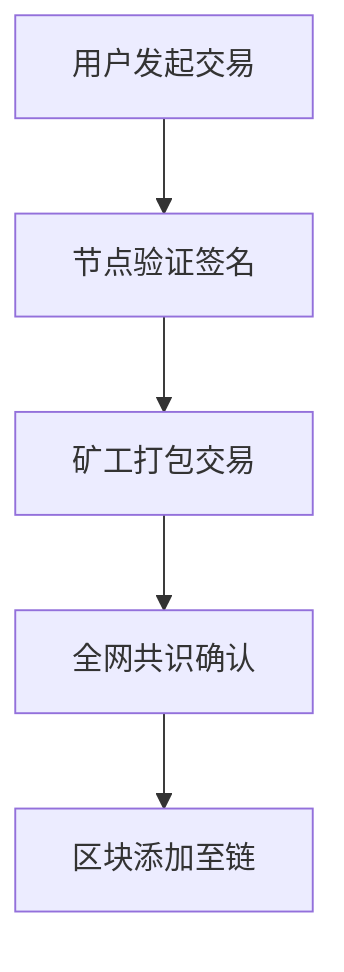

# 加密货币：机遇与挑战全解析

## 引言：数字金融新时代的开端
加密货币作为数字经济时代的重要创新，正以前所未有的速度重塑全球金融体系。根据国际清算银行数据，2023年全球加密货币市值已突破2.5万亿美元，日均交易量超700亿美元。这种去中心化货币形态不仅改变了传统金融格局，更催生了去中心化金融（DeFi）等新兴生态。本文将系统解析加密货币的核心特征、技术原理及发展现状。

---

## 什么是加密货币？

### 定义与核心特征
加密货币（Cryptocurrency）是通过密码学技术实现的数字化价值存储与交换媒介。其核心特征包括：
- **去中心化架构**：基于区块链技术，无需中央银行或中介机构
- **加密安全性**：采用SHA-256等加密算法保障交易安全
- **总量可控性**：多数加密货币设定发行上限（如比特币2100万枚）
- **交易透明性**：所有交易记录永久存储在分布式账本中

👉 [了解主流加密货币类型](https://bit.ly/okx_welcome)

### 发展历程
从2009年中本聪创建比特币开始，加密货币经历了三个发展阶段：
1. **2009-2013**：比特币的诞生与早期实验
2. **2014-2017**：以太坊等智能合约平台兴起
3. **2018至今**：DeFi、NFT与Web3生态爆发式增长

---

## 技术原理：区块链如何运作？

### 区块链技术架构
加密货币依托的区块链技术包含三大核心技术：
1. **分布式账本**：数据存储于全球节点而非单一服务器
2. **共识机制**：工作量证明（PoW）与权益证明（PoS）确保交易有效性
3. **智能合约**：自动执行预设条件的可编程协议

### 交易验证流程

---

## 发展机遇：重塑金融生态的三大优势

### 降低交易成本
跨境汇款案例显示，传统银行手续费平均为5-7%，而加密货币转账费用通常低于1%。Ripple网络已实现跨境支付成本降低80%。

### 金融包容性提升
据世界银行统计，全球仍有14亿成年人无法获得传统银行服务。加密货币钱包用户数已突破4亿，其中超60%来自发展中国家。

### 创新应用场景
| 应用领域 | 典型案例 | 技术支撑 |
|---------|----------|----------|
| 去中心化金融 | Uniswap自动做市商 | 智能合约 |
| 数字身份认证 | Microsoft ION网络 | 区块链DID |
| 供应链金融 | VeChain质量溯源 | 物联网+区块链 |

👉 [探索区块链创新应用](https://bit.ly/okx_welcome)

---

## 发展挑战：需突破的三大瓶颈

### 监管框架缺失
全球仅38%国家建立完整加密货币监管体系，主要面临：
- 反洗钱（AML）合规难题
- 投资者权益保护机制缺失
- 跨境支付监管协调困难

### 价格波动剧烈
比特币历史最大回撤达83%，以太坊最大回撤达95%。波动性指数（HV30）显示，加密货币市场波动率是美股的5-8倍。

### 技术扩展性限制
主流公链性能对比：
| 区块链 | TPS | 确认时间 | 能源消耗 |
|--------|-----|----------|----------|
| Bitcoin | 7 | 10分钟 | 高（PoW） |
| Ethereum | 15-45 | 15秒 | 中等（PoW→PoS） |
| Solana | 3,000+ | 0.5秒 | 低（PoH） |

---

## 全球发展格局：从边缘到主流的演进

### 国家战略对比
- **支持型**：新加坡、瑞士建立加密货币监管沙盒
- **谨慎型**：欧盟实施严格反洗钱监管（MiCA法案）
- **禁止型**：中国全面禁止加密货币交易

### 机构投资者参与
贝莱德、富达等机构已推出比特币ETF产品，机构持仓占比从2018年的5%升至2023年的32%。

---

## 未来展望：技术创新与合规发展

### 技术演进方向
1. **隐私计算**：零知识证明（ZKP）提升交易匿名性
2. **跨链协议**：Polkadot、Cosmos实现多链互通
3. **绿色挖矿**：液冷矿机与可再生能源结合

### 监管科技（RegTech）兴起
智能合规系统可实现：
- 自动KYC验证
- 实时交易监控
- 风险预警建模

---

## 常见问题解答（FAQ）

### Q1：加密货币与央行数字货币（CBDC）有何区别？
A：加密货币基于公有链，具有抗审查特性；CBDC由央行发行，采用许可链架构，强调法偿性和货币政策传导。

### Q2：如何安全存储加密资产？
A：建议采用冷钱包存储（如硬件钱包），分散存储于多个地址，并启用多重签名机制。交易所存储不宜超过总资产的5%。

### Q3：DeFi与传统金融的核心差异？
A：DeFi通过智能合约实现无许可金融协议，具有透明度高、门槛低的特点，但缺乏存款保险等传统保障机制。

👉 [获取加密资产存储指南](https://bit.ly/okx_welcome)

---

## 结语：在变革中把握机遇
加密货币正从边缘创新走向主流金融基础设施。根据麦肯锡预测，到2030年全球区块链市场规模将达3万亿美元。参与者需要平衡技术创新与风险控制，在合规框架下探索可持续发展路径。对于普通投资者，建议采取"学习-实践-投资"的渐进策略，通过小额试水积累经验。